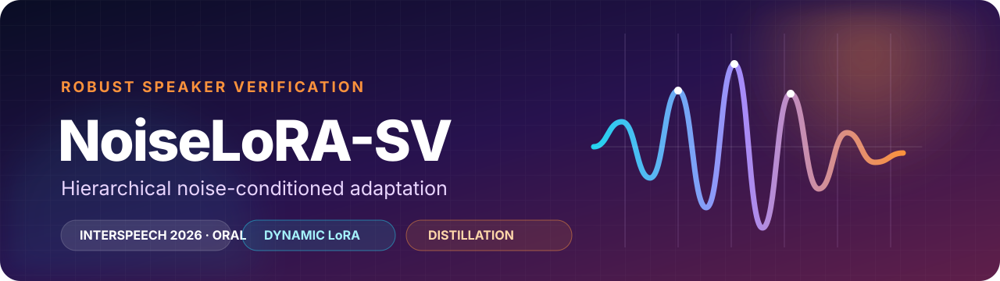
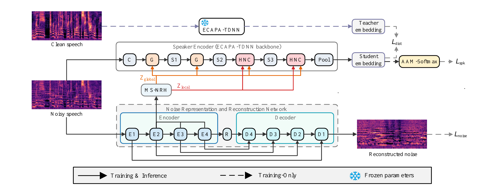
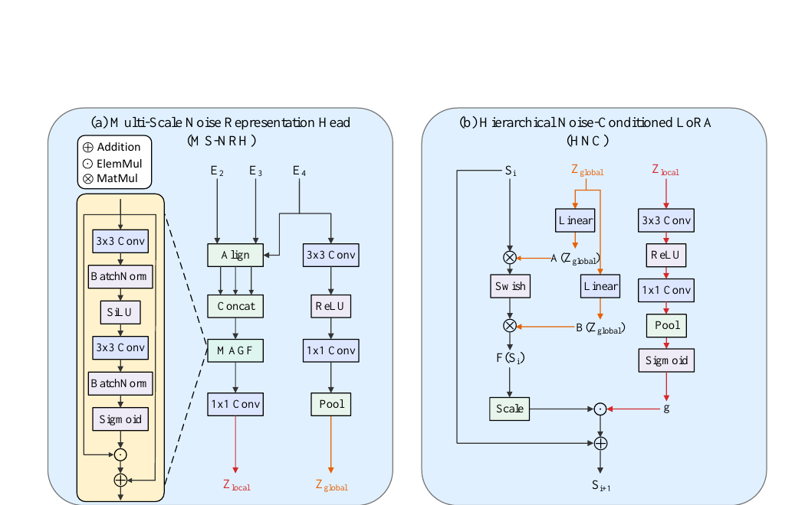
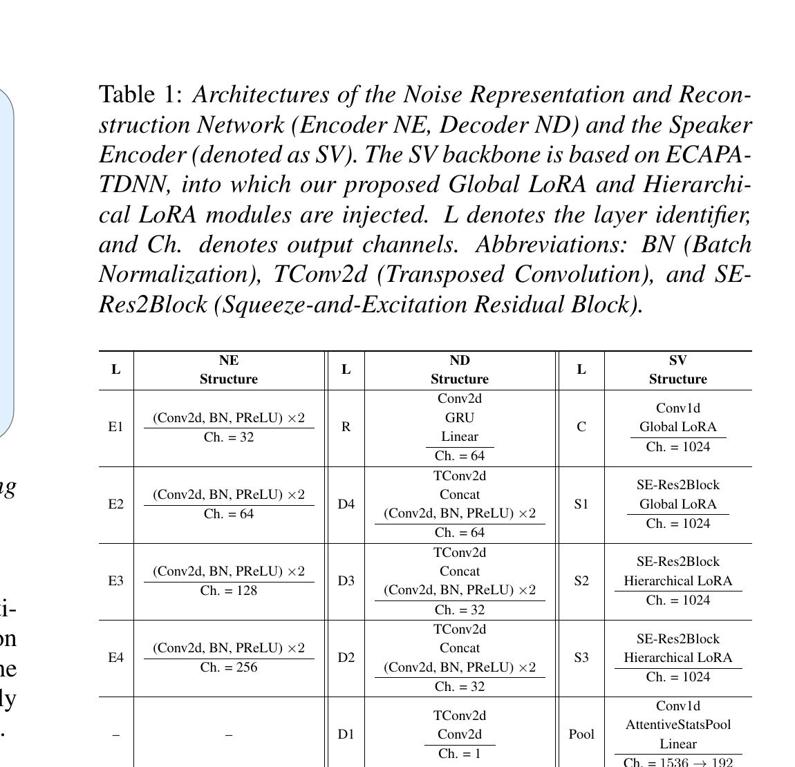
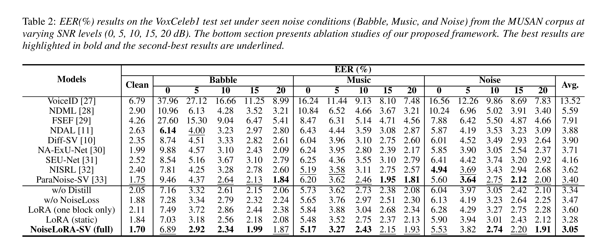
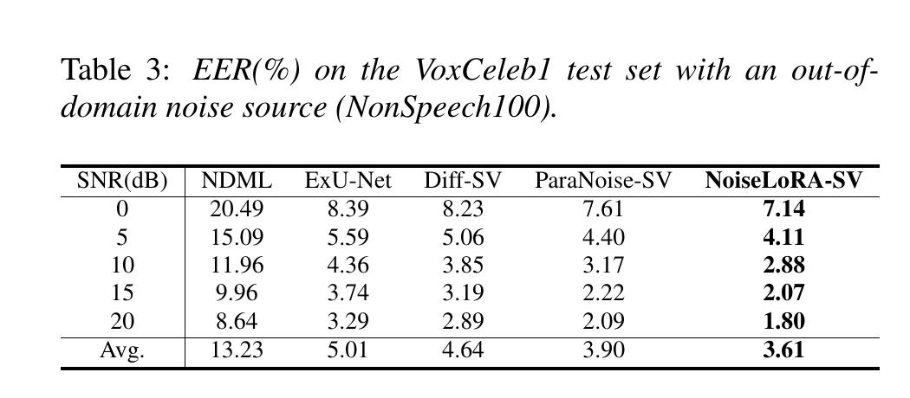
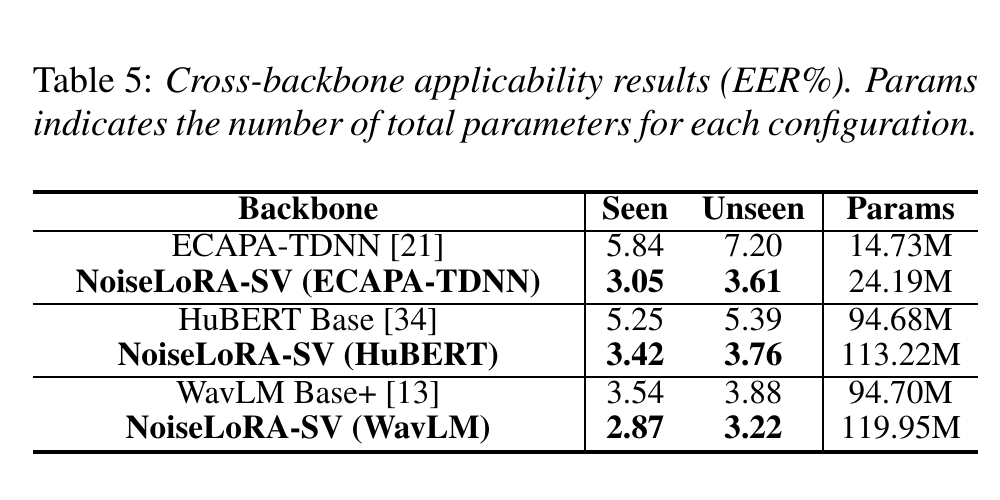

<div align="center">
  
</div>

<div align="center">
  <br>
  <a href="#publication-status"></a>
  <a href="#publication-status"></a>
  <a href="#publication-status"></a>
  <a href="LICENSE"></a>
</div>

<h1 align="center">NoiseLoRA-SV</h1>

<p align="center">
  <strong>Hierarchical Noise-Conditioned Adaptation with Embedding Distillation for Robust Speaker Verification</strong>
</p>

<p align="center">
  Dai Gao<sup>*</sup> · Chen Jiang<sup>*</sup> · Sizhe Liu · Peng Zhang<br>
  <sub><sup>*</sup> Equal contribution</sub>
</p>

> [!IMPORTANT]
> **Publication status:** Accepted as an **Oral Presentation at Interspeech 2026**. The conference has not yet taken place, so the paper is not yet listed in the official online proceedings. The public paper link and final proceedings metadata will be added after release.

NoiseLoRA-SV is a dynamic, instance-adaptive framework for speaker verification in non-stationary noise. It reconstructs noise explicitly, extracts global and local noise representations, generates LoRA weights on the fly, and aligns noisy speaker embeddings with a frozen clean teacher.

## Why NoiseLoRA-SV

- **Instance-adaptive LoRA** — adaptation weights are generated from the current utterance instead of remaining fixed after training.
- **Hierarchical conditioning** — global noise context guides shallow layers; local time-varying features gate deeper layers frame by frame.
- **Explicit noise modeling** — a CRN reconstructs the additive noise and supplies multi-scale representations through MS-NRH and MAGF.
- **Clean-manifold distillation** — supervised masked InfoNCE pulls noisy embeddings toward clean teacher embeddings without collapsing speaker identity.
- **Cross-backbone design** — the paper validates the method with ECAPA-TDNN, HuBERT Base, and WavLM Base+.

## Architecture

<p align="center">
  
</p>

The noisy utterance is processed by two coupled branches. A CRN reconstructs the noise and produces hierarchical noise features, while an ECAPA-TDNN speaker encoder receives dynamic Global and Hierarchical Noise-Conditioned LoRA updates. The frozen clean teacher and reconstruction decoder are used for training supervision; the adapted speaker branch produces the verification embedding.

### Noise-aware adaptation modules

<p align="center">
  
</p>

- **MS-NRH + MAGF:** aligns and fuses encoder features from E2, E3, and E4 into local noise features while E4 also yields a global noise embedding.
- **Global Noise-Conditioned LoRA:** generates utterance-specific low-rank projections for the C and S1 stages.
- **Hierarchical Noise-Conditioned LoRA:** combines global hypernetwork weights with a local sigmoid gate at S2 and S3 for frame-level modulation.

<details>
<summary><strong>View the exact architecture configuration from the paper</strong></summary>
<br>
<p align="center">
  
</p>
</details>

## Results

All values below are reported in the paper. The displayed figures are faithful crops of the original manuscript tables; the numerical content has not been redrawn or modified.

### Seen-noise robustness

<p align="center">
  
</p>

NoiseLoRA-SV obtains the best average EER in the paper's seen-noise evaluation while retaining a 1.70% clean EER. The ablations isolate the contribution of distillation, explicit noise reconstruction, hierarchical placement, and dynamic conditioning.

### Unseen-noise generalization and noise modeling

<p align="center">
  
</p>

Table 3 reports out-of-domain generalization on NonSpeech100: NoiseLoRA-SV reaches **3.61% average EER** and gives the best result at every tested SNR from 0 to 20 dB. Table 4 shows that explicit noise reconstruction outperforms noise-attribute estimation on both seen and unseen conditions.

### Cross-backbone applicability

<p align="center">
  
</p>

The same adaptation idea improves ECAPA-TDNN, HuBERT Base, and WavLM Base+, showing that the method is not tied to one speaker encoder family.

## Quick start

### 1. Install

```bash
git clone https://github.com/j128djsj/NoiseLoRA-SV.git
cd NoiseLoRA-SV
python -m venv .venv
source .venv/bin/activate
```

Install a PyTorch and torchaudio build that matches your operating system and compute platform, then install the remaining dependencies:

```bash
pip install -r requirements.txt
python -m pytest -q
```

On Windows, activate the environment with `.venv\Scripts\activate`.

### 2. Prepare data

Datasets and pretrained checkpoints are not bundled. Follow [Data Preparation](docs/data_preparation.md) to prepare:

- VoxCeleb1/2 speech and trial lists;
- disjoint MUSAN train/test noise splits;
- NonSpeech100 for out-of-domain evaluation;
- a clean ECAPA-TDNN teacher checkpoint.

Then set the corresponding paths in `configs/noiselora_ecapa.yaml`.

### 3. Train

```bash
python main.py --config configs/noiselora_ecapa.yaml --mode train
```

The paper configuration uses 16 kHz audio, 3-second crops, 80-bin log-Mel features, dynamic 0–20 dB MUSAN mixing, and a 192-dimensional speaker embedding.

### 4. Evaluate

```bash
# Clean trials
python main.py --config configs/noiselora_ecapa.yaml --mode eval \
  --condition clean --checkpoint /path/to/checkpoint.pth

# Seen MUSAN noise
python main.py --config configs/noiselora_ecapa.yaml --mode eval \
  --condition seen --noise-type babble --snr 10 \
  --checkpoint /path/to/checkpoint.pth

# Unseen NonSpeech100 noise
python main.py --config configs/noiselora_ecapa.yaml --mode eval \
  --condition unseen --snr 10 --checkpoint /path/to/checkpoint.pth
```

If `--snr` is omitted, evaluation runs the configured SNR list automatically. See [Reproduction Notes](docs/reproduction.md) for checkpoint validation, EER computation, and paper-aligned evaluation details.

## Repository map

| Path | Purpose |
| --- | --- |
| `src/noiselora_sv/models/` | ECAPA-TDNN, CRN, MS-NRH, MAGF, and noise-conditioned LoRA modules |
| `src/noiselora_sv/data/` | VoxCeleb loading, noise sampling, cropping, and audio preprocessing |
| `src/noiselora_sv/losses/` | AAM-Softmax, masked InfoNCE distillation, and noise reconstruction loss |
| `src/noiselora_sv/training/` | Task orchestration, data loading, logging, optimization, and scheduling |
| `src/noiselora_sv/utils/` | Configuration, checkpoints, metrics, summaries, and reproducibility helpers |
| `configs/` | Baseline and NoiseLoRA-SV experiment configurations |
| `docs/` | Data preparation and reproduction guidance |
| `tests/` | Forward/backward, gradient, checkpoint, data, CLI, and evaluation tests |
| `assets/paper/` | Selected architecture figures and experimental tables from the manuscript |

## Reproduction notes

- Training and evaluation require explicit, non-overlapping MUSAN split directories.
- A valid clean teacher checkpoint is required when `loss.distill_weight > 0`.
- Full NoiseLoRA-SV evaluation checks coverage for the student, noise network, and C/S1/S2/S3 adapters; ECAPA-only checkpoints are rejected.
- EER uses tied-score grouping, explicit endpoints, linear interpolation at crossings, and finite-score validation.
- Results can vary slightly with dependency versions, hardware, seeds, and dataset preparation.

## Tests

```bash
python -m pytest -q
```

The test suite covers forward/backward behavior, finite losses, teacher freezing, adapter and CRN gradients, baseline construction, noise mixing, supervised InfoNCE masking, checkpoint safety, and CLI validation.

## Acknowledgements

The ECAPA-TDNN backbone is adapted from [TaoRuijie/ECAPA-TDNN](https://github.com/TaoRuijie/ECAPA-TDNN) under the MIT License. See [Third-Party Notices](THIRD_PARTY_NOTICES.md) and the preserved [upstream license](licenses/ECAPA-TDNN-MIT.txt).

## Publication status

NoiseLoRA-SV has been accepted for an **oral presentation at Interspeech 2026**. Because the conference has not yet taken place, there is currently no official proceedings page, DOI, or indexed online record to link. This section and `CITATION.cff` will be updated when the proceedings are published.

## Citation

Until the final proceedings metadata is available, please use:

```bibtex
@inproceedings{gao2026noiselora,
  title     = {NoiseLoRA-SV: Hierarchical Noise-Conditioned Adaptation with
               Embedding Distillation for Robust Speaker Verification},
  author    = {Gao, Dai and Jiang, Chen and Liu, Sizhe and Zhang, Peng},
  booktitle = {Proceedings of Interspeech},
  year      = {2026},
  note      = {Accepted oral presentation; proceedings metadata forthcoming}
}
```

## License

The source code is released under the [MIT License](LICENSE). Selected manuscript figures and tables are provided for project documentation; see [NOTICE](NOTICE.md) for their separate status.
